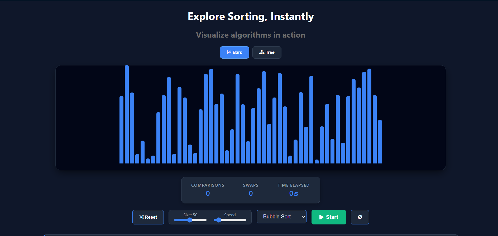
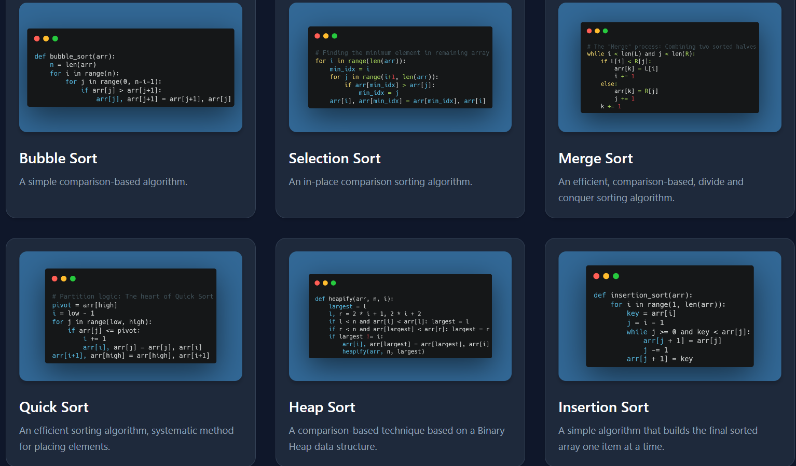

# Sorting Visualizer

A polished, interactive web application that visualizes classic sorting algorithms in real time. This project is built with modern React and Vite tooling and focuses on clarity, performance metrics, and educational value.




## Demo

- Live demo: https://sorting-visualizer-lime-alpha.vercel.app/

---

## Key Features

- Algorithm visualizations for learning and experimentation
- Adjustable array size and animation speed controls
- Real-time metrics: comparisons, swaps, and elapsed time
- Multiple views including bars and tree/graph representations
- Clean, component-driven UI for easy extension

---

## Algorithms Included

- Bubble Sort
- Heap Sort
- Merge Sort
- Quick Sort

The algorithm implementations live in `src/algorithms` and are separated from UI rendering.

---

## Tech Stack

- **React 19** — UI library (functional components & hooks)
- **Vite** — Development server and build tooling
- **JavaScript (ES2020+)** — Application logic
- **HTML5 & CSS3** — Markup and styling
- **ESLint** — Linting and code quality
- **Node.js & npm** — Local development and package management

---

## Getting Started

Prerequisites:

- Node.js (v16+ recommended)
- npm (or yarn)

Install and run locally:

```bash
git clone https://github.com/elifTugbatezcan/sorting_visualizer.git
cd sorting-visualizer/sorting-visualizer
npm install
npm run dev
```

Build for production:

```bash
npm run build
npm run preview
```

---

## Project Structure (high level)

```
src/
├─ algorithms/        # Sorting algorithm implementations (pure JS)
├─ components/        # Reusable React components (Visualizer, Controls, Panels)
├─ utils/             # Helper utilities
├─ App.jsx            # Root component
└─ main.jsx           # App entry
```

---

## Contributing

Contributions are welcome. Typical improvements include adding new algorithms, improving accessibility, or enhancing visualizations. Please open an issue first to discuss larger changes.

Suggested workflow:

1. Fork the repository
2. Create a feature branch
3. Add tests or verify behavior locally
4. Open a pull request with a clear description

---

## License & Acknowledgements

This repository is provided as-is for educational purposes. Include a LICENSE file if you want to specify reuse terms.

Thanks to the open-source community for the tooling (React, Vite, ESLint).

---
